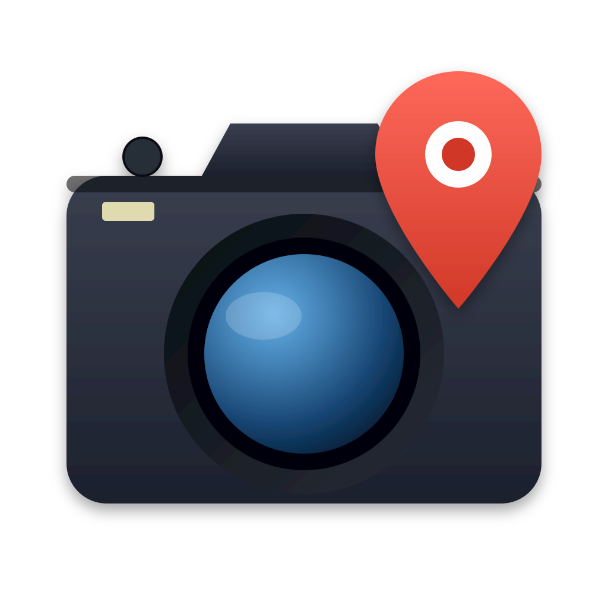

<p align="center">
  
</p>

<h1 align="center">GPSPhotoTag</h1>

<p align="center">
  <i>Tag photos with GPS EXIF from GPX tracks or Google location history.</i>
</p>

---

## What it does

You take photos. Sometimes you also have a GPX track from a watch, app,
or handheld GPS. When you don't, your phone's Google location history
covers you. **GPSPhotoTag** writes accurate GPS EXIF into your photos using
the first source that has a match for the photo's timestamp:

1. **GPX tracks** you provide (best precision).
2. **Google location history** as a fallback: Takeout `Records.json` or
   per-day Timeline JSON / KML exports — both auto-detected.

If nothing matches within the time threshold, the photo is reported and
left untouched.

**Supported formats:**

| Family | Extensions | Write strategy |
|---|---|---|
| JPEG | `.jpg`, `.jpeg` | lossless via `piexif` |
| HEIC | `.heic`, `.heif` | Pillow + `pillow-heif` (re-encodes) |
| PNG  | `.png` | Pillow (re-encodes, writes `eXIf` chunk) |
| RAW  | `.raf .nef .nrw .cr2 .cr3 .crw .arw .sr2 .srf .dng .rw2 .orf .pef .ptx .raw .rwl .srw .x3f .iiq .3fr .erf` | XMP sidecar (default) or `exiftool` embed |

## Install

```bash
# inside a fresh venv
pip install -r requirements.txt
pip install -e .

# or with extras:
pip install -e ".[dev]"
```

Python 3.10+.

## Quickstart

```bash
# Tag every JPEG in a directory with a single GPX, in place:
gpsphototag --photo ~/Pictures/Trip/ --gps trip.gpx --overwrite

# Glob + dir, write to a separate output folder:
gpsphototag --photo "DSC*.jpg" ~/Pictures/Trip/ \
         --gps tracks/ \
         --out tagged/

# GPX + Google fallback, replacing any existing GPS bytes:
gpsphototag --photo ~/Pictures/2024/ \
         --gps tracks/ \
         --maps-history takeout/Records.json timeline_export/ \
         --out tagged/ --replace

# Dry run — see what would happen without touching files:
gpsphototag --photo ~/Pictures/Trip/ --gps trip.gpx --dry-run
```

## CLI reference

| Flag | Description |
|---|---|
| `--photo / -p PATH ...` | Photo file, glob, or directory (recursive). Repeatable. **Required.** |
| `--gps / -g PATH ...` | GPX file, glob, or directory. Repeatable. |
| `--maps-history / -m PATH ...` | Google Takeout `Records.json` or Timeline JSON/KML. Auto-detected. Repeatable. |
| `--out / -o DIR` | Write tagged photos here (originals untouched). |
| `--overwrite` | Modify originals in place. Required when `--out` is absent. |
| `--replace` | Overwrite existing GPS bytes inside the photo (otherwise such photos are skipped). |
| `--raw-mode {auto,sidecar,embed}` | RAW write strategy. `auto` (default) embeds GPS into the RAW via `exiftool` when available, else writes `photo.raf.xmp`. `sidecar` always writes the XMP sidecar (never touches the RAW). `embed` forces `exiftool`. |
| `--fix-dates {exif,file}` | Also fix dates. `exif`: set the file's created/modified date from the EXIF timestamp. `file`: write EXIF `DateTimeOriginal` from the file's created date. Runs standalone (no GPS source required). See [Fixing dates](#fixing-dates---fix-dates). |
| `--map PNG` | **Read-only.** Render a heatmap PNG of where the photos were taken (from GPS already in the photos) and exit — no tagging. See [Heatmap](#heatmap---map). |
| `--map-dpi DPI` | Resolution of the `--map` PNG. Default `200`. |
| `--map-clusters SEL` | When photos span multiple locations, which to include: `all`, or comma-separated cluster numbers (e.g. `1,2`). If omitted you're prompted interactively. |
| `--max-time-diff SECONDS` | Max gap between photo time and GPS point(s). Default `300`. |
| `--timezone TZ` | IANA tz used when EXIF lacks `OffsetTimeOriginal`. Default: system local. |
| `--dry-run` | Locate + report only; write nothing. |
| `--verbose / -v` | DEBUG-level console logging. |
| `--log-file PATH` | Also write INFO+ logs to this file. |

### `--replace` vs `--overwrite` — what's the difference?

They are independent guards.

- `--overwrite` = *"yes, modify the original file"* (file-safety guard).
  Required when `--out` is not given.
- `--replace` = *"yes, overwrite the GPS bytes already inside the file"*
  (data-loss guard). Without it, photos that already carry GPS are
  reported as `already_tagged` and left alone.

| `--out` | `--overwrite` | `--replace` | Result |
|:---:|:---:|:---:|---|
| set | – | – | Tag into `out/`; already-tagged photos copied unchanged |
| set | – | ✓ | Tag into `out/`; existing GPS overwritten |
| – | ✓ | – | Tag in place; already-tagged photos skipped |
| – | ✓ | ✓ | Tag in place; existing GPS overwritten |
| – | – | – | **error**: refuse to write — pass `--out` or `--overwrite` |
| – | – | ✓ | error — `--replace` needs a destination |
| set | ✓ | * | error — pick one destination |

## Fixing dates (`--fix-dates`)

Two directions, in addition to (or instead of) GPS tagging. It runs
standalone — you don't need a GPS source.

- **`--fix-dates exif`** — set the *file's* created/modified date **from**
  the photo's EXIF `DateTimeOriginal`. Useful after copies/edits scrambled
  the filesystem timestamps. Works for every supported format, including
  RAW (read via `exifread`).
- **`--fix-dates file`** — write the EXIF `DateTimeOriginal` **from** the
  file's created date (birthtime, falling back to modified time). Useful
  for scans or exports that never had an EXIF date.

```bash
# realign file dates to the EXIF capture time, in place:
gpsphototag --photo ~/Pictures/Trip/ --overwrite --fix-dates exif

# stamp EXIF from the filesystem date, writing copies to out/:
gpsphototag --photo ~/Scans/ --out dated/ --fix-dates file
```

Notes:

- On macOS the Finder **"Date Created"** (birthtime) is set via the
  `SetFile` tool (Xcode command-line tools). If `SetFile` isn't installed,
  only the modified/accessed time is set and a warning is logged.
- `--fix-dates file` for **RAW** writes the capture date into the file via
  `exiftool` (works under the default `auto` mode when exiftool is present,
  or with `--raw-mode embed`). Under `--raw-mode sidecar` it's skipped with
  a note, since a capture date can't go into an XMP sidecar.
- Combine freely with GPS tagging — the row shows the GPS status plus a
  date note; standalone date runs report the `dates_fixed` status.

## Heatmap (`--map`)

Render a modern density heatmap of *where* your photos were taken — a
Google-Photos-style warm glow over a clean light basemap, with a crisp dot per
photo on top so every individual location stays visible (even a single shot far
from any cluster). It's **read-only**: it reads the GPS already in the photos
and writes a single PNG; it never tags.

```bash
# Heatmap of an already-tagged trip, high resolution:
gpsphototag --photo ~/Pictures/Trip/ --map trip.png --map-dpi 300
```

- **Auto-zoom.** The map fits the bounding box of the photos — tight for a
  single neighbourhood, wide for a road trip.
- **Multiple locations.** If your photos fall into geographically distinct
  groups (e.g. a trip plus a stray shot from the departure airport), the tool
  lists the clusters — reverse-geocoded to place names — and asks which to
  include. Pass `--map-clusters all` or `--map-clusters 1,2` to choose
  non-interactively.
- **Install.** Map rendering needs the optional extra:
  `pip install 'gpsphototag[map]'` (adds `matplotlib`, `contextily`, `geopy`).
  Basemap tiles are fetched from CARTO, so an internet connection is required
  when generating.

```text
Photos span 2 distinct locations:
  [1] Tirana, Albania — 70 photo(s)
  [2] Tårnby Municipality, Denmark — 1 photo(s)
Which location(s) to map? [number(s) e.g. 1,2 — or 'all']:
```

## Getting Google location data

Google's live Timeline API was deprecated in 2024; the data now lives on
your phone or in Takeout.

- **Takeout `Records.json`** — your *entire* history.
  Go to <https://takeout.google.com>, deselect everything, then select
  "Location History (Timeline)" and export. Unzip; pass the `Records.json`
  file to `--maps-history`.
- **Per-day Timeline export** — useful for a single trip.
  Google Maps app → your profile → Your Timeline → ⋯ → "Export Timeline data".
  Pass the resulting folder to `--maps-history`; GPSPhotoTag auto-detects
  JSON and KML files inside.

## RAW workflow

**Reading RAW timestamps.** GPSPhotoTag reads EXIF from TIFF-based RAW
(`.nef/.cr2/.dng/.arw/.orf/.pef/.rw2`, …) with pure-Python `exifread`.
Containers exifread can't parse — **Fujifilm `.RAF`**, **Canon `.CR3`**,
`.crw`, `.x3f` — are read via `exiftool` instead, so install it
(`brew install exiftool`) to tag those. Without exiftool, GPSPhotoTag logs a
clear warning and leaves such photos untouched.

**Writing GPS to RAW.** By default GPSPhotoTag writes *into* the RAW file
itself when it can. Three `--raw-mode` values:

- **`auto` (default)** — embed GPS directly into the RAW via `exiftool`
  when it's available; otherwise fall back to an XMP sidecar. This means
  you get tags inside the file whenever possible, with a graceful fallback.
- **`embed`** — force embedding via `exiftool` (errors if it's missing).
- **`sidecar`** — always write `your-photo.raf.xmp` next to the RAW and
  never touch the RAW bytes. Pure Python, no external binary. Lightroom,
  darktable, and digiKam read these natively. Use this if you'd rather keep
  RAW files pristine.

Install exiftool for embedding: `brew install exiftool` (macOS) /
`apt install libimage-exiftool-perl` (Debian/Ubuntu). When writing to
`--out`, the RAW is copied there first, so originals stay untouched in
every mode.

If a photo has either inline GPS *or* a sibling `.xmp` sidecar, it's
considered already tagged (skipped unless you pass `--replace`).

## Caveats

- **HEIC/HEIF re-encodes** — JPEG is written losslessly via `piexif`.
  HEIC and PNG go through Pillow, which re-encodes pixel data on save.
  Use `--out` if you care about preserving originals.
- **RAW writes default to embedding** (`--raw-mode auto`) via `exiftool`,
  modifying the RAW's metadata in place. Use `--raw-mode sidecar` to keep
  RAW files byte-for-byte pristine (writes a separate `.xmp` instead), or
  `--out DIR` to embed into copies and leave originals untouched.
- **Threshold tuning** — `--max-time-diff` defaults to 5 minutes. For
  sparse data (Google location history often samples every ~5–15 min),
  bump to e.g. `--max-time-diff 900`. For tight GPX tracks (every 1–5 s),
  the default is generous already.
- **Timezone** — most modern cameras and phones write `OffsetTimeOriginal`.
  If yours doesn't, set `--timezone Europe/Paris` (or whichever IANA name).

## Development

```bash
pip install -e ".[dev]"
pytest -q                  # run tests
ruff check gpsphototag tests  # lint
```

Layout:

```
gpsphototag/
  cli.py            argparse + main
  collectors.py     resolve --photo / --gps / --maps-history paths
  exif.py           read DateTimeOriginal, write GPS + datetime (JPEG/HEIC/PNG; dispatches RAW)
  raw_writer.py     RAW: exifread reads, XMP sidecar writes, exiftool subprocess
  dates.py          --fix-dates: read/set filesystem timestamps (SetFile on macOS)
  gpx_source.py     gpxpy → TimedPoint list (sorted, UTC)
  google_source.py  Records.json / Timeline JSON / KML → TimedPoints
  locator.py        GPX > Google, exact-or-linear-interpolated
  tagger.py         per-photo orchestration honoring out/overwrite/replace
  display.py        rich-based live status + summary
  types.py          TimedPoint, LocationResult, PhotoRow, Status
tests/
  conftest.py       generates real tiny JPEG/PNG/HEIC + GPX/JSON/KML
  test_*.py         per-module tests, including AC suite + RAW round-trip
```

Test fixtures are *generated* (not committed) so binary files don't sit
in git.

## License

Copyright © 2026 Kodsama (Alexandre Martins).

GPSPhotoTag is free software, licensed under the **GNU General Public
License v3.0 or later (GPL-3.0-or-later)** — see [LICENSE](LICENSE). It comes
with no warranty, to the extent permitted by law.
